# Ripple Insertion: Dynamic TSP Solver



[](https://github.com/mcarbonell/ripple-insertion/actions/workflows/ci.yml)
[](https://opensource.org/licenses/MIT)

**Ripple Insertion** (Recursive Cheapest Insertion) is an experimental algorithm designed for **Dynamic Traveling Salesperson Problem (TSP)** scenarios. Unlike traditional solvers that calculate a route from scratch, this algorithm specializes in integrating new points into an existing route in real-time, optimizing locally via a cascading "ripple" effect.

## 🌊 What is Dynamic TSP?

In static TSP, all cities are known upfront. In dynamic (or online) TSP, cities appear incrementally, and the route must adapt on the fly without causing unacceptable delays.

Imagine the route as a tight elastic band stretched around nails (cities). When you add a new nail, you stretch the band to cover it. This creates local "tension". The Ripple Insertion algorithm checks nearby "stressed" cities. If moving a city to a nearby edge releases tension (shortens distance), it moves, propagating the check outwards like a ripple until the route stabilizes.

## ✨ Features

- **Real-Time Responsive:** Spatial index ($O(M \log N)$ per insertion) with localized cascading wave relocation, avoiding global recalculation.
- **Zero Dependencies:** Pure JavaScript implementation (ES Modules).
- **Event-Driven:** Emits `inserted`, `rippleStep`, and `tourUpdated` events natively via `EventTarget`, ideal for visualizations.
- **Optimized Data Structures:** Uses a self-balancing KD-Tree for spatial nearest-neighbor queries and a Doubly Linked Tour with Map indexing for $O(1)$ operations.
- **Post-Processing Refinement:** Optional 2-opt and Or-opt operators to refine tours after batch insertion.

## 🎯 Use Cases

| Scenario                                       | Recommended Solver   | Why?                                                                                  |
| :--------------------------------------------- | :------------------- | :------------------------------------------------------------------------------------ |
| **Interactive UI** (User clicks to add points) | **Ripple Insertion** | Visually pleasing "organic" adjustment; zero UI freeze.                               |
| **Gaming AI** (RTS Unit Pathing)               | **Ripple Insertion** | Fast, "good enough" routing that reacts to map changes in real-time.                  |
| **Logistics/Delivery** (Adding a stop)         | **Ripple Insertion** | Retains existing route structure while locally optimizing. Instant feedback.          |
| **Static Planning** (1000 stops from scratch)  | **LKH**              | If you don't need real-time insertions, use LKH for better global optimization power. |

## 🚀 Quick Start

### Installation

You can include it directly in your project. It is written using ES Modules.

```javascript
import { RippleInsertion } from './src/ripple-insertion.js';

// 1. Initialize the solver
const solver = new RippleInsertion({
  edgeWeightType: 'EUC_2D', // Distance metric (EUC_2D, GEO, ATT, CEIL_2D)
  maxK: 20, // Base nearest neighbors
  adaptiveMaxK: true, // Adaptive: scales M = max(maxK, floor(4 * log2(N)))
});

// 2. Listen to events for visualization (Optional)
solver.on('tourUpdated', (e) => {
  console.log(`Tour updated:`, e.detail);
});

// 3. Add cities dynamically
solver.addCity(0, 100, 200);
solver.addCity(1, 150, 300);
solver.addCity(2, 50, 50);

// 4. Retrieve the optimal tour and cost
const tour = solver.getTour(); // Returns array of city IDs: [0, 1, 2]
const cost = solver.getCost(); // Returns total distance
```

### 2-opt Post-Processing

After inserting all cities, you can optionally apply 2-opt local search to further improve the tour:

```javascript
// Apply 2-opt refinement after all insertions
const twoOptStats = solver.apply2Opt();
console.log(
  `2-opt: ${twoOptStats.improvements} improvements in ${twoOptStats.iterations} iterations`
);

// Get the improved tour and cost
const optimizedTour = solver.getTour();
const optimizedCost = solver.getCost();
```

**When to use 2-opt:**

- When quality is more important than speed
- For static or batch scenarios where you can afford extra computation
- After all cities have been inserted (not during real-time insertion)

**Performance impact:**

- Adds ~10-30% overhead depending on tour size
- Typically improves gap by 1-3% on standard benchmarks
- Best for tours with 50+ cities

### City Removal

You can also remove cities dynamically from the tour:

```javascript
// Remove a city from the tour
const removeStats = solver.removeCity(1);
console.log(
  `Removed city 1: ${removeStats.removedCost} cost savings in ${removeStats.iterations} ripple iterations`
);

// Get the updated tour
const tour = solver.getTour();
const cost = solver.getCost();
```

### Batch Insertion

You can also insert multiple cities at once with optimized insertion order:

```javascript
// Add multiple cities at once
const cities = [
  { id: 10, x: 100, y: 200 },
  { id: 11, x: 150, y: 300 },
  { id: 12, x: 200, y: 250 },
  { id: 13, x: 80, y: 180 },
];

// Without optimization (uses file order)
const stats1 = solver.addCities(cities);

// With onion peeling (convex hull first - better quality)
const stats2 = solver.addCities(cities, { useOnionPeeling: true });
console.log(
  `Inserted ${cities.length} cities in ${stats2.totalTime.toFixed(2)}ms`
);
```

**Benefits of onion peeling:**

- Inserts cities from outside (convex hull) inward
- Provides better initial tour structure
- Reduces total ripple iterations

### Post-Processing Optimization

After inserting all cities, you can apply local search operators to improve tour quality:

```javascript
// Apply 2-opt optimization
const twoOptStats = solver.apply2Opt();

// Apply Or-opt optimization
const orOptStats = solver.applyOrOpt();
```

**Operator effects:**

- **2-opt**: Reverses tour segments to eliminate edge crossings
- **Or-opt**: Relocates cities to better positions in the tour
- Combined: Best quality, moderate time increase

## 📊 Benchmarks

Performance on standard TSPLIB instances (`EUC_2D`) with post-processing (reproduced with `npm run benchmark`):
_Gap is compared against the known optimal static solution. The primary strength of Ripple Insertion is real-time dynamic insertion without global recalculation._

| Instance | N | Type | Optimal | Achieved | Gap (%) | Time (ms) | Time/Ins (ms) | Ripples/Ins |
| :--- | :--- | :--- | :--- | :--- | :--- | :--- | :--- | :--- |
| **eil51** | 51 | EUC_2D | 426 | 444 | 4.23% | 4.3 | 0.081 | 16.1 |
| **berlin52** | 52 | EUC_2D | 7542 | 7783 | 3.20% | 15.3 | 0.271 | 16.3 |
| **st70** | 70 | EUC_2D | 675 | 691 | 2.37% | 7.8 | 0.104 | 17.9 |
| **kroA100** | 100 | EUC_2D | 21282 | 21292 | 0.05% | 12.9 | 0.123 | 20.3 |
| **ch130** | 130 | EUC_2D | 6110 | 6372 | 4.29% | 29.5 | 0.216 | 21.7 |
| **ch150** | 150 | EUC_2D | 6528 | 6691 | 2.50% | 25.8 | 0.164 | 22.9 |

> Raw reproducible JSON and CSV artifacts are generated in `results/benchmark_report.json` and `results/benchmark_report.csv`.

### Comparison with other heuristics

| Algorithm | Complexity | Best for... | Typical Gap (N=100) | Dynamic? |
| :--- | :--- | :--- | :--- | :--- |
| **Nearest Neighbor** | O(N²) | Extreme speed | 15-30% | ❌ |
| **Cheapest Insertion** | O(N²) | Baseline construction | 10-20% | ❌ |
| **LKH-3 (Lin-Kernighan-Helsgaun)** | O(N²)-O(N³.²) | **Best quality (offline static)** | 0.0-0.5% | ❌ |
| **👉 Ripple Insertion** | Sub-quadratic | **Dynamic + Interactive Real-Time** | **~2-4%** | ✅✅✅ |

## 🛠️ Development

Run the test suite:

```bash
npm test
```

Run benchmarks and produce reproducibility artifacts:

```bash
npm run benchmark
```

Check code formatting:

```bash
npm run format:check
```

## 📜 License

MIT
