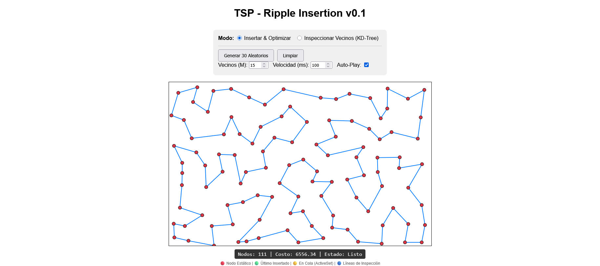

# Ripple Insertion: A Spatially-Constrained Dynamic TSP Solver

**Author:** Mario Raúl Carbonell Martínez

**Ripple Insertion** (Recursive Cheapest Insertion) is an experimental algorithm
designed for **Dynamic TSP** scenarios. Unlike traditional solvers that
calculate a route from scratch, this algorithm specializes in **integrating new
points into an existing route in real-time**, optimizing locally via a cascading
"ripple" effect.

## 🌊 The Core Concept

Imagine the TSP tour as a tight elastic band stretched around nails (cities).

1.  **Insertion:** When you add a new nail, you stretch the band to cover it
    (Cheapest Insertion).
2.  **Tension (Ripple):** This action creates local "tension" at the insertion
    point. The new city might pull the route into a shape that makes a
    neighboring city's position inefficient.
3.  **Relaxation:** The algorithm checks the "stressed" cities. If moving a city
    to a nearby edge releases tension (shortens distance), it moves.
4.  **Propagation:** Moving that city creates _new_ tension at its old and new
    positions. The check propagates outwards like a ripple until the route
    stabilizes.

## ⚙️ Architecture

The algorithm relies on three key components working in unison:

### 1. Initial Insertion (Local Search Cheapest Insertion)

When a new node $N_{new}$ is added:

- We scan the current nearest neighbors using a KD-Tree to find the edge
  $(A, B)$ where inserting $N_{new}$ results in the minimum total distance
  increase.
- Complexity: $O(log N)$ (where $N$ is current tour size).

### 2. Spatial Query (KD-Tree)

To optimize efficiently, we avoid checking every possible position in the tour.

- A **KD-Tree** maintains the spatial index of all cities.
- When optimizing a node, we query its **$M$ Nearest Neighbors** (e.g., $M=20$).
- We _only_ consider moving the node to edges adjacent to these spatial
  neighbors. This assumes that a city's optimal position in the tour is likely
  near its physical location.

### 3. Cascade Queue (The Ripple)

This is the recursive/iterative engine.

- A `Set` (queue) tracks "Active Nodes" that need optimization.
- Initially, the inserted node and its immediate neighbors are added.
- **Loop:** While the set is not empty:
  1.  Pop a node $C$.
  2.  Use KD-Tree to find candidate positions (edges near $C$).
  3.  Calculate the **Gain** of moving $C$ to a new position vs. keeping it.
  4.  **If Gain > 0:**
      - Move $C$.
      - Add $C$'s _old_ neighbors to the queue (edge broken).
      - Add $C$'s _new_ neighbors to the queue (edge created).
      - (Optional) Add $C$ back to queue.

## 📝 Pseudo-Code

```python
function AddCity(newCity):
    KDTree.insert(newCity)

    # Step 1: Standard Insertion
    best_edge = FindCheapestInsertion(newCity, current_tour)
    Insert(newCity, best_edge)

    # Step 2: Trigger Ripple
    Queue.add(newCity)
    Queue.add(best_edge.startNode)
    Queue.add(best_edge.endNode)

    ProcessRipple(Queue)

function ProcessRipple(Queue):
    while Queue is not empty:
        node = Queue.pop()

        # Constrained Search
        spatial_neighbors = KDTree.nearest(node, K=20)
        candidate_edges = GetEdgesConnectedTo(spatial_neighbors)

        best_move = null

        # Check if moving 'node' to a candidate edge improves cost
        for edge in candidate_edges:
            gain = CostOfRemoving(node) - CostOfInserting(node, edge)
            if gain > 0: # Or > epsilon
                best_move = edge

        if best_move:
            # Apply topology change
            old_neighbors = GetNeighbors(node)
            MoveNode(node, best_move)

            # Propagate instability
            Queue.add(old_neighbors)
            Queue.add(best_move.startNode)
            Queue.add(best_move.endNode)
```

## 📊 Complexity & Performance

Let $N$ be the number of cities and $M$ be the number of spatial neighbors
checked.

- **Standard Local Search (2-Opt/Relocate):** Typically scans $O(N^2)$ moves to
  find an improvement.
- **Ripple Insertion:**
  - Insertion: $O(\log N)$ with KD-Tree acceleration
  - Optimization Step: $O(M)$ (Checking $M$ neighbors is constant time
    relative to $N$).
  - Total Complexity: $O(N \log N + C \cdot M)$, where $C$ is the number of
    cascade steps (ripples).
  - In practice, $C$ is small for local adjustments. The cascade Steps are 0
    the 70% of times, 1-5 20% of times, 5+ 10% of times.

**Result:** An algorithm that scales almost linearly $O(N \log N)$ for building
complete tours, making it capable of handling real-time interactions with
hundreds or thousands of nodes without lag.

### Benchmark Results (TSPLIB)

Performance on standard TSP instances (EUC_2D):

| Instance | N   | Optimal | Achieved  | Gap   | Ratio |
| -------- | --- | ------- | --------- | ----- | ----- |
| eil51    | 51  | 426     | 444.89    | 4.43% | 1.044 |
| berlin52 | 52  | 7542    | 7782.98   | 3.20% | 1.032 |
| st70     | 70  | 675     | 700.66    | 3.80% | 1.038 |
| eil76    | 76  | 538     | 572.39    | 6.39% | 1.064 |
| pr76     | 76  | 108159  | 114729.01 | 6.07% | 1.061 |
| kroA100  | 100 | 21282   | 21392.52  | 0.52% | 1.005 |
| kroB100  | 100 | 22141   | 22800.27  | 2.98% | 1.030 |
| kroC100  | 100 | 20749   | 21724.11  | 4.70% | 1.047 |
| kroD100  | 100 | 21294   | 22699.33  | 6.60% | 1.066 |
| kroE100  | 100 | 22068   | 23250.70  | 5.36% | 1.054 |
| eil101   | 101 | 629     | 659.82    | 4.90% | 1.049 |
| ch130    | 130 | 6110    | 6369.37   | 4.24% | 1.042 |
| ch150    | 150 | 6528    | 6693.12   | 2.53% | 1.025 |

**Average Gap: ~4.0%** - Excellent results for an $O(N \log N)$ algorithm
designed for dynamic insertion rather than static optimization.

UPDATE: With bigger instances the performance degrades

| Instance | N   | Optimal  | Achieved | Gap    | Ratio  |
| :------- | :-- | :------- | :------- | :----- | :----- |
| tsp225   | 225 | 3916.00  | 4229.62  | 8.01%  | 1.0801 |
| a280     | 280 | 2579.00  | 2779.26  | 7.76%  | 1.0776 |
| pcb442   | 442 | 50778.00 | 55360.84 | 9.03%  | 1.0903 |
| rat575   | 575 | 6773.00  | 7452.18  | 10.03% | 1.1003 |
| d657     | 657 | 48912.00 | 55231.00 | 12.92% | 1.1292 |

I have some ideas to improve the algorithm:

- Add more operators, not only Relocate, as 2-opt, 3-opt, or-opt, etc.
- Start with the convex hull. Now the insertion order is as appears in the
  TSPLIB file.
- Increase the number of neigbours M as a function of N.

## 📊 **Comparison with other heuristics**

| Algorithm                     | Complexity     | Best for...               | Typical Gap (N=100) | Dynamic? |
| ----------------------------- | -------------- | ------------------------- | ------------------- | -------- |
| **Nearest Neighbor**          | O(N²)          | Extreme speed             | 5-15%               | ❌       |
| **Cheapest Insertion**        | O(N²)          | Decent quality            | 4-8%                | ❌       |
| **Savings (Clarke-Wright)**   | O(N²)          | Routes with close points  | 5-10%               | ❌       |
| **LKH (Simulated Annealing)** | O(N²)          | **Best quality (static)** | 0.5-2%              | ❌       |
| **👉 Ripple Insertion**       | **O(N log N)** | **Dynamic + Interactive** | **~4%**             | ✅✅✅   |

## 🎯 Use Cases

| Scenario                                            | Recommended Solver   | Why?                                                                         |
| :-------------------------------------------------- | :------------------- | :--------------------------------------------------------------------------- |
| **Static Planning** (Route 1000 stops from scratch) | **LKH**              | Better global optimization power.                                            |
| **Dynamic/Online** (Add stop to active route)       | **Ripple Insertion** | Retains existing route structure while locally optimizing. Instant feedback. |
| **Interactive UI** (User clicks to add points)      | **Ripple Insertion** | Visually pleasing "organic" adjustment; zero UI freeze.                      |
| **Gaming AI** (RTS Unit Pathing)                    | **Ripple Insertion** | Fast, "good enough" routing that reacts to map changes.                      |

## 🔍 Demo

Open `ripple-insertion-animated.html` in your browser to visualize the
algorithm.



- **Green Node:** The newly inserted city.
- **Yellow Nodes:** Cities currently being evaluated/moved by the ripple effect.
- **Blue Lines (Inspect Mode):** Visualizes the KD-Tree neighbor queries.
